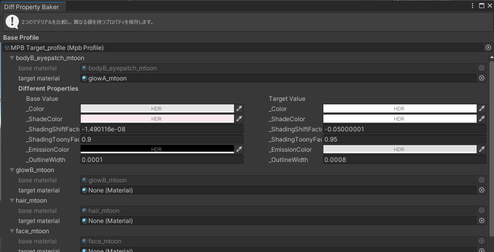
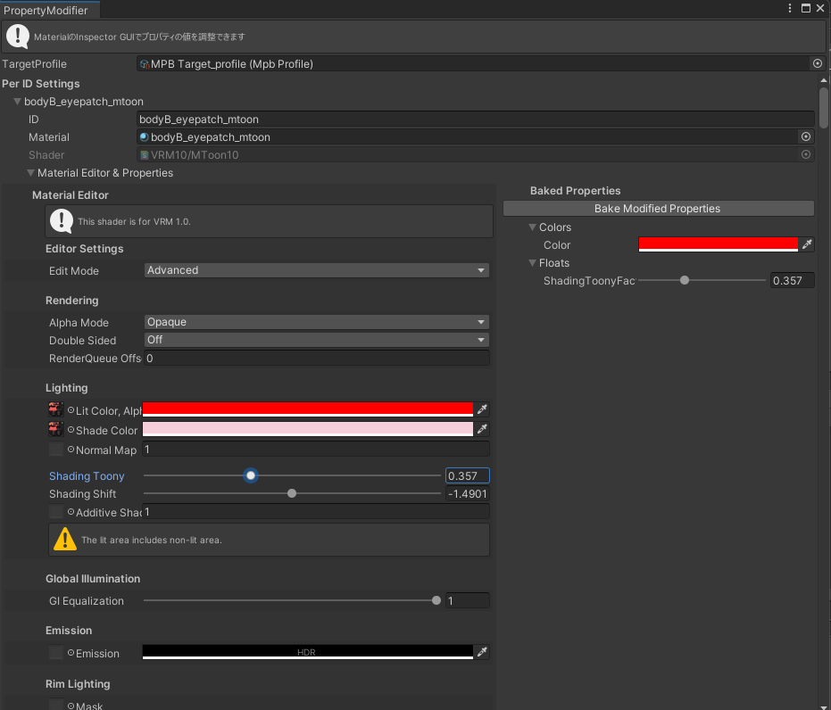

# MaterialPropertyBaker

マテリアルに変更を加えることなく、タイムラインで動的にマテリアルの値を調整することができるシステムです。

## Install

### gitから直接導入

UnityのPackage Managerの`Add package from git URL...` に以下URLを入れることで導入可能

```
https://github.com/sui4/MaterialPropertyBaker.git
```

`#`の後にブランチ名、タグ名を入れることで特定のタグ、ブランチを指定することが可能

```
https://github.com/sui4/MaterialPropertyBaker.git#{tag,branch}
```

### ダウンロード後、ローカルで導入

1. 任意のフォルダに git clone や ZIPとしてMaterialPropertyBakerをダウンロード

2. UnityのPackage Managerの`Add package from disk...` からダウンロードしたフォルダ直下にある`package.json`を選択することで導入可能

Git Submoduleを使うことでバージョン管理が容易になります。

## 注意事項

デモプロジェクトにはキャラクタへの使用例としてぞん子3Dモデルを用いています。

※ぞん子3Dモデル（「ZONKO 3D MODEL type-N」）の利用規約を必ずご確認の上、使用してください。
 利用規約：https://zone-energy.jp/3dmodel/terms.pdf

## セットアップ手順

1. マテリアルをタイムラインで制御したい対象に`MPB TargetGroup` コンポーネントをアタッチ
2. `Create MPB Profile` ボタンを押してprofileを生成
3. profileからベースのマテリアルから変更したい値を設定
4. Timelineに`MaterialPropertyBaker/TargetGroup Track` を追加
5. Clipを生成、紐づけたいProfileをClipにアタッチ

6. タイムラインを再生すればprofileの値が適用されます！

## 補助ツール

### Diff Baker

切り替えたい値のセットが他のマテリアルとして保存されてる場合におすすめです。

Profileに紐付けられてるマテリアルと対象のマテリアルを比較して値が異なるプロパティをProfileに保存します。

ツールバー `MaterialPropertyBaker/Diff Property Baker`よりウィンドウを開けます。



### Edit with Material Inspector

対象のマテリアルのインスペクターを使って値を調整・Bakeすることができます。

編集したいProfileをセットすると、IDごとに紐付けられてるマテリアルのインスペクターが表示されます。このインスペクターからプロパティを編集してください。

`Bake Modified Properties`を押すと、元のマテリアルと値が違うプロパティがProfileにBakeされます。

※なお、元々ProfileにBakeされているプロパティがある場合、マテリアルのインスペクタには適用された状態で表示されます。

ツールバー `MaterialPropertyBaker/Edit with Material Inspector`よりウィンドウを開けます。



